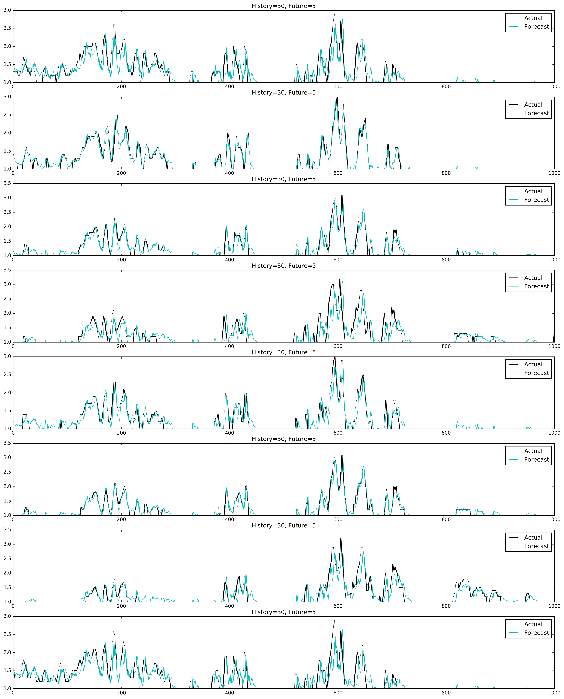
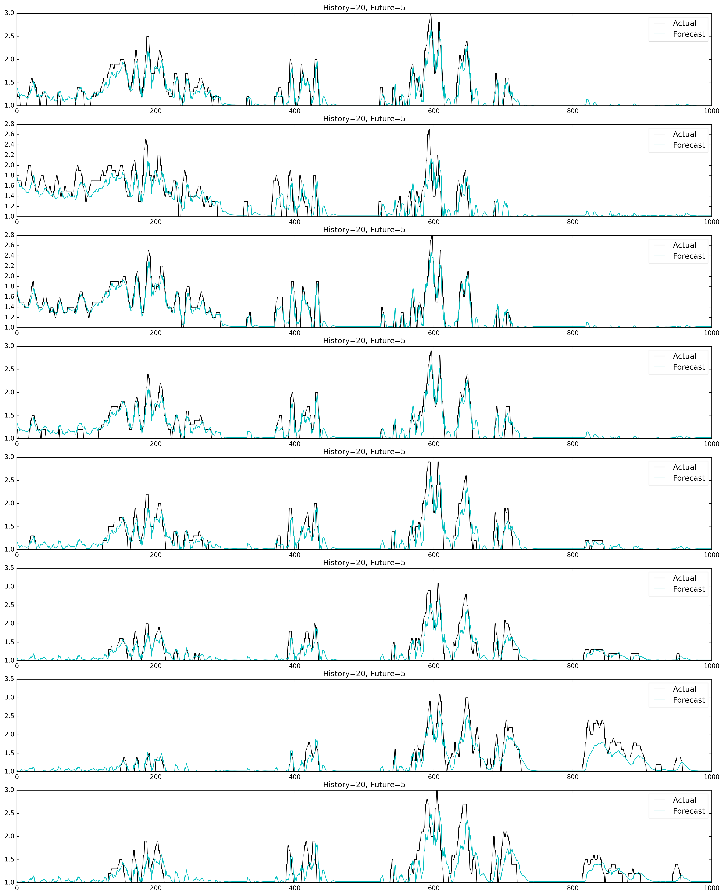

# Inspiration
I have been exploring different ways to work with timer series data. There are
the classical ways, moving average, auto regressive, ARIMA, ARCH/GARCH etc for
univariate and VAR, bayesian, etc for multivariate. These all kind of suck. For
one time series is an afterthought in Python at this point and 2nd it turns out
time series models aren't really used to forecast for the most part; they are
mostly used to look back at events and try and see what caused them. Well I want
to forecast. Enter the Recurrent Neural Net.

## Long Short Term Memory
If you're reading this I'm sure you've seen models that can write original jokes,
pickup lines, city names, poems, and even entire scripts of things like
Shakespeare and even the Star Wars movies. How is this possible? Long Short
Term Memory (LSTM) cells. The way a Recurrent NN is designed allows it to learn
from past words, letters, or as is my case lags of time. All of these scenarios
are sequential, they all rely on the things that came before it, and that's all
time series is really. The LSTM layer, or layers have three different gates
inside of the cells, one to decide whether to let new info in, one to decide to
erase the state or not, and one to decide what info to output.

## My Model so far
The results are good, almost annoyingly good actually. Since I am still learning
how to best set up and tweak this type of model I should be able to squeak out
even better results. As of right now I have around a .035 mean square error score.
This is for a forecast of 5 minutes in the future for 16 different points. The
model has an input layer with 16 nodes, one hidden LSTM layer with 256 nodes
and dropout, and one output layer with 16 nodes.

It looks like this:

```python
# Build my neural net
net = tf.input_data(shape=[None, steps_of_history, 16])
net = tf.lstm(net, 256, return_seq=False)
net = tf.dropout(net, 0.5)
net = tf.fully_connected(net, 16, activation='linear')
net = tf.regression(net, optimizer='sgd', loss='mean_square', learning_rate=0.3)
```

## Look at these graphs!





I'm still playing around with all of this really, but as you can see even now
it's giving the best results I've gotten for this data set of mine. It performs
better than my ExtraTreesRegression already and that was only forecasting 3
minutes ahead, at 5 minutes it was a little to inaccurate for my tastes. It can
be seen here https://github.com/matthewswogger/Surge_Forecast_ExtraTrees it's
very usable but the extra 2 minutes this model gives us while also being more
accurate is hard to beat.

#### Packages used


* sqlite3
* pandas
* numpy
* itertools
* tflearn
* Matplotlib.pyplot
