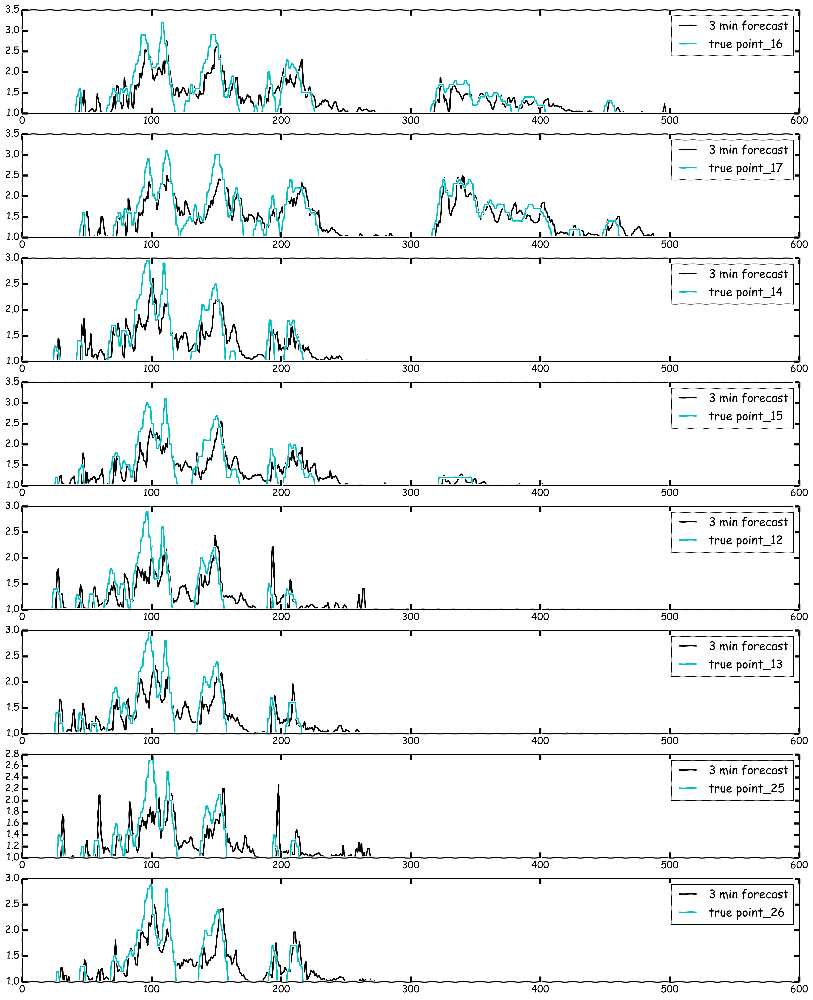
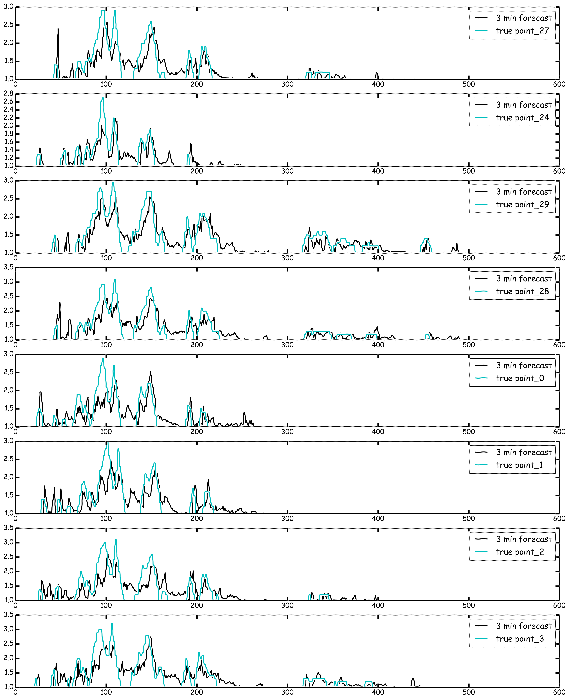

## Surge Forecast

Matthew Swogger, October 2016

#### Inspiration

My capstone project for Galvanize Data Science Immersive was about forecasting
the Surge multiplier for Uber Rideshare drivers. The idea was to see if I could
tell drivers where and at what value the surge would be before it happened.
After thinking about how far into the future would be useful to a driver I
settled on 5 min; I figured this would be enough time in a crowded city for a
driver to both have enough time to decide on where they would start heading as
well as enough time to get there without speeding and chancing a ticket, after
all this is about making money and paying for tickets is the opposite of that.

So it's time series, I know how to do that, throw an ARIMA model at it. Maybe
I have to difference the data once or twice and I'll need to see which lags
should be used by looking at the Autocorrelation and Partial Autocorrelation
but basically it's straight forward, right? Wrong! Time series implementation in
Python does not do it justice. I spent days watching
`statsmodels.tsa.statespace.sarimax.SARIMAX` blow up when I change one thing
in the parameters. I'd add one extra lag and it throws an error, the data
had not changed. Ask the internet what is going on and the answer is, 'if you're
doing time series you need to use R.' Anyway, I got through it, got it to
forecast well enough, with about an 89% accuracy, and it passed the 'would this
actually be useful to me if I was trying to make money Rideshareing,' it would
be a nice little addition. But it got me thinking about other ways to implement
this.

### Overview

One way to deal with time series data is to just get rid of the time series
nature of it all together. For example, take a weeks worth of on the minute
surge data for one point, that's univariate 10,080 entries, and just treat this
as your target variable `y`, so that's 10,080 data points. To create my `X` I
took the first 60 lags and assigned those as the features for the target
variable. I then remove lags 1-5 to create the 5 minute forecast. Now you can
run any sort of Regression model that you want on the data.

### Be careful though

One thing to keep in mind before I go running `train_test_split` is that this
randomizes the data. This is what I want when running Regressions but it does
make graphing your predicted forecast impossible because it both gets rid of
order and is different every time the model is run so the graph will be different
and useless. I make sure to set aside a portion of data that will never be
randomized preserving it's time series nature.

### What Regression model is best?

Because I don't care if the model is interpretable it opens me up to models
other than Linear Regression, so I wanted to compare as many as I could think of.
So I cooked up a helper class to help with performing grid search on all of
them. The class is called `EstimatorSelectionHelper()` and has two methods
`.fit()` and `.score_summary()`. This takes in a dictionary of all of the models
you want to grid search and another dictionary of the parameters you want to
use in your grid search for all of the models. These were the models and
parameters that I used:

```python
models1 = {'LinearRegression':LinearRegression(),
           'Ridge':Ridge(),
           'Lasso':Lasso(),
           'ExtraTreesRegressor':ExtraTreesRegressor(),
           'RandomForestRegressor':RandomForestRegressor(),
           'AdaBoostRegressor':AdaBoostRegressor(),
           'GradientBoostingRegressor':GradientBoostingRegressor()}

params1 = {'LinearRegression':{},
           'Ridge':{'alpha':[0.001, 0.01, 0.1, 1.0]},
           'Lasso':{'alpha':[0.001, 0.01, 0.1, 1.0]},
           'ExtraTreesRegressor':{'n_estimators':[8,16,32,64,128]},
           'RandomForestRegressor':{'n_estimators':[8,16,32,64,128]},
           'AdaBoostRegressor':{'n_estimators':[8,16,32,64,128],'learning_rate':[0.6,0.8,1.0]},
           'GradientBoostingRegressor':{'n_estimators':[8,16,32,64,128],'learning_rate':[0.6,0.8,1.0]}}
```
After grid searching all of this a pandas dataframe is printed with the results
and sorted to have the best performing one on top. What ended up being the best
performing model was `ExtraTreesRegressor(n_estimators=128)`.

## Forecast of first 8 points



## Forecast of second 8 points




#### Example

The model is built to predict where and when and how many rides will get dropped off given any location in NYC. Every single block in NYC has as a story to tell. Finding a resource that can tell this story in a meaningful manner is a difficult task. A marketing team foreign to NYC will have little idea about how to navigate this concrete jungle.

Using Ryd.io this team will be able to focus their efforts accordingly and minimize misallocation of resources. Let's check out an example query

#### Example query: "Terra Blues, Thursday 9pm"


#### How it works

Once a user enters a query, Google API returns a latitude and longitude of that location...and then the magic happens.

With that latitude and longitude we pull a geo bounding box of data from elastic search signaling to us the relavent rides. Now that we know how many rides came into the users location per day for the year, we can feed this information into our SARIMA model. The output of the SARIMA model will tell us how many rides it predicts that location will have at a given point in the future.

Knowing how many rides will land in a day is great, but we really would like to know at which hour these rides will come. Utlizing the cluster map (below) we can find the nearest cluster point that the users location is near and apply that hourly distribution to our 'rides per day estimate' output from the SARIMA model. This output signals to us how many rides will come in a given hour.

But where do we put the points on the map? We can't just put them randomly anywhere in our bounding box...some of them might land on top of buildings...not great. In order to adjust for this we will use a multivariate KDE that randomly resamples from a distrubtion that was built off of where rides appeared in the past. Basically we are saying..."hey Ryd, where have all the rides landed for this location the past? Now if you were to guess where these rides would arrive this time where would it be?"


#### Project Pipeline

NYC Taxi Data Set -> Elasticsearch/BigQuery
Return per day totals for over 9000 points in NYC -> Python Pandas
Save this file as json/csv for future use
User queries location -> Flask/AJAX/Python
Pull data for a user queried location -> Elastic
Train SARIMA model -> sklearn
Cross reference daily estimate with cluster hourly distribution
Apply resampled KDE with hourly distrubtion for geo estimates
Project points on map and display meta data

#### Future Steps

### Viz
To have this tool have appeal to a non-technical audience I'd like to make a much more interactive web-app complete with sliders and more minute query preferences at the users disposal. It would be awesome to be able to ask Ryd, "I want to see map of high density areas that have been labeled with art, farmers markets, and have low crime."

### Model
As Ryd stands right now we are focused solely on dropoff locations and times. However, dropoff locations and times make up only 15% of the information available through the NYC Taxi data set. There is a TON more analysis to be done on pick up locations, number of people riding in the car and combinations of it all.

Once we're ready, we can easily incorporate other data sources as well. It would be great to see an overlay of restaurants and bars in NYC and the correlate the connection between drop offs and establishment frequency.

#### Packages used

* bigquery for python
* pandas
* time
* numpy
* itertools
* os.istdir
* glob
* os
* rv_discrete
* scipy.stats
* requests
* json
* threading
* Queue
* rauth
* BeautifulSoup
* Matplotlib.pyplot
