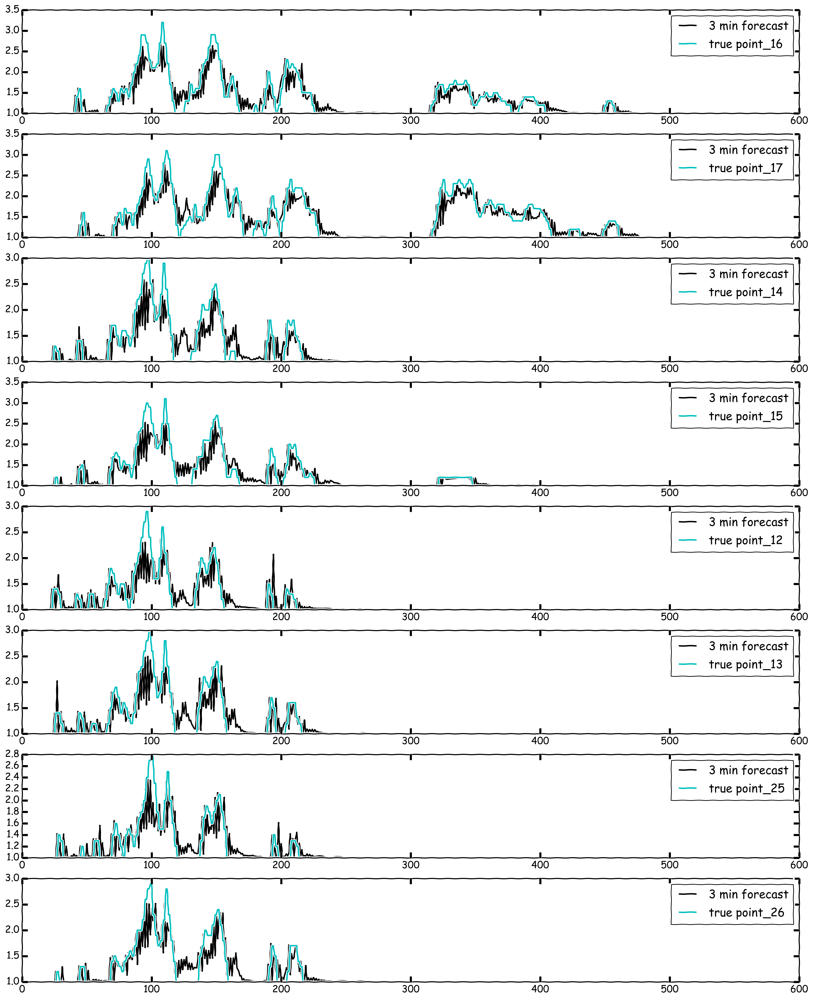

# Surge Forecast

Matthew Swogger, October 2016

## Inspiration

My capstone project for Galvanize Data Science Immersive was about forecasting
the Surge multiplier for Uber Rideshare drivers. The idea was to see if I could
tell drivers where and at what value the surge would be before it happened.
After thinking about how far into the future would be useful to a driver I
settled on 5 min; I figured this would be enough time in a crowded city for a
driver to both have enough time to decide on where they would start heading as
well as enough time to get there without speeding and chancing a ticket, after
all this is about making money and paying for tickets is the opposite of that.

So it's time series, I know how to do that, throw an ARIMA model at it. Maybe
I have to difference the data once or twice and I'll need to see which lags
should be used by looking at the Autocorrelation and Partial Autocorrelation
but basically it's straight forward, right? Wrong! Time series implementation in
Python does not do it justice. I spent days watching
`statsmodels.tsa.statespace.sarimax.SARIMAX` blow up when I change one thing
in the parameters. I'd add one extra lag and it throws an error, the data
had not changed. Ask the internet what is going on and the answer is, 'if you're
doing time series you need to use R.' Anyway, I got through it, got it to
forecast well enough, with about an 89% accuracy, and it passed the 'would this
actually be useful to me if I was trying to make money Rideshareing,' it would
be a nice little addition. But it got me thinking about other ways to implement
this.

## Overview

One way to deal with time series data is to just get rid of the time series
nature of it all together. For example, take a weeks worth of on the minute
surge data for one point, that's univariate 10,080 entries, and just treat this
as your target variable `y`, so that's 10,080 data points. To create my `X` I
took the first 60 lags and assigned those as the features for the target
variable. I then remove lags 1-5 to create the 5 minute forecast. Now you can
run any sort of Regression model that you want on the data.

## Be careful though

One thing to keep in mind before I go running `train_test_split` is that this
randomizes the data. This is what I want when running Regressions but it does
make graphing your predicted forecast impossible because it both gets rid of
order and is different every time the model is run so the graph will be different
and useless. I make sure to set aside a portion of data that will never be
randomized preserving it's time series nature. The rearranging of the data and
all the train, test, and hold-out splitting is done with the `prepare_data()`
class and can be viewed in `prepare_data.py`.

## What Regression model is best?

Because I don't care if the model is interpretable it opens me up to models
other than Linear Regression, so I wanted to compare as many as I could think of.
So I cooked up a helper class to help with performing grid search on all of
them. The class is called `EstimatorSelectionHelper()` and has two methods
`.fit()` and `.score_summary()`, it can be viewed in `grid_search_helper.py`.
This takes in a dictionary of all of the models you want to grid search and
another dictionary of the parameters you want to use in your grid search for all
of the models. These were the models and parameters that I used:

```python
models1 = {'LinearRegression':LinearRegression(),
           'Ridge':Ridge(),
           'Lasso':Lasso(),
           'ExtraTreesRegressor':ExtraTreesRegressor(),
           'RandomForestRegressor':RandomForestRegressor(),
           'AdaBoostRegressor':AdaBoostRegressor(),
           'GradientBoostingRegressor':GradientBoostingRegressor()}

params1 = {'LinearRegression':{},
           'Ridge':{'alpha':[0.001, 0.01, 0.1, 1.0]},
           'Lasso':{'alpha':[0.001, 0.01, 0.1, 1.0]},
           'ExtraTreesRegressor':{'n_estimators':[8,16,32,64,128]},
           'RandomForestRegressor':{'n_estimators':[8,16,32,64,128]},
           'AdaBoostRegressor':{'n_estimators':[8,16,32,64,128],'learning_rate':[0.6,0.8,1.0]},
           'GradientBoostingRegressor':{'n_estimators':[8,16,32,64,128],'learning_rate':[0.6,0.8,1.0]}}
```
After grid searching all of this a pandas dataframe is printed with the results
and sorted to have the best performing one on top. What ended up being the best
performing model was `ExtraTreesRegressor(n_estimators=128)`.

After settling on the ExtraTreesRegressor I then ran a second grid search on a
few different parameters within it. While there are a number of parameters to
choose from they all basically do one of two things; limit the number of features
a tree can use to make decisions or limit the depth of the trees. I ended up
allowing use of all the features and setting a max depth for trees of 12 so
ended up with `ExtraTreesRegressor(n_estimators=128,n_jobs=-1,max_depth=12)`.

## Autocorrelation and Differencing

At this point I was getting around .08 mean squared error but I wanted to see
what running Autocorrelation on the data would tell me about what lags have
signal and could help narrow down what features to use. I also decided to
difference the data and see if that could help. Both of these techniques gave
worse results, but when I combine this with my original model by tacking on a few
extra features in the form of differenced lags that I could see were correlated
by checking out the autocorrelation the model improved and gave me a mean squared
error of .05, cool.

## Enough talk, show me pretty graphs

### Forecast of first 8 points



### Forecast of second 8 points


## Models, lot's and lot's of Models

After establishing what the best model was it was time to run it on 16 different
points. Once again, I created a class for this. Class `train_models()` can be
viewed in `train_models.py` and it takes in the prepared data from earlier and
runs extratrees on all 16 points. You simply run `.fit()` and then there is a
method to predict on the `.predict_on_test_sets()` or the
`.predict_on_hold_out_sets()` and you can compute the mean squared error  on the
`.mse_on_test_sets()` or the `.mse_on_hold_out_sets()`. The mean squared error
on the hold out sets for all 16 points ends up being about .05, not bad. As you
can see from the graphs above the forecast is pretty spot on, it has a few issues
with forecasting surge above double the price, but from a driver standpoint if
the surge is anything north of double price they are happy as can be.

## Surge Maps

### Actual


### Forecast


## Conclusion

As you can see from the beautiful maps above the forecasting model is
performing well. If you were a driver looking to make money and you looked down
at your phone and saw that forecast you'd know where to go and be there right
when the surge hits.

With that said, while I'm happy with the performance of this model, and it feels
really good to know that time series forecasting can be done without an ARIMA
model, I've been playing with RNN's trying to learn neural nets. So far it looks
very promising, I think it will work even better than this and I will have a
working RNN model in a GitHub repo soon, so stay tuned.

#### Packages used


* pandas
* numpy
* itertools
* sklearn
* Matplotlib.pyplot
